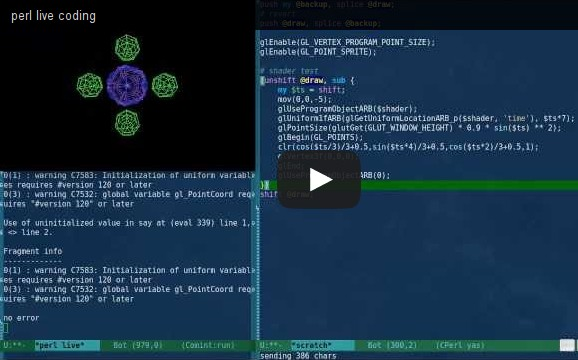
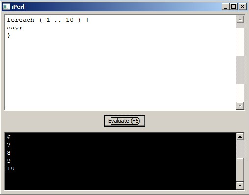

# iPerl - Simple Perl REPL GUI using wxPerl and AnyEvent

## Description

iPerl is an attempt to make a beginner friendly GUI REPL with standard REPL features and live-coding features.

Inspiration for live-coding and code stolen from [vividsnow on blogs.perl.org](http://blogs.perl.org/users/egor/2013/05/perl-live-coding.html)

[](http://www.youtube.com/watch?v=BCUtu4urY9w)

## Installing

### From source

```
git clone https://github.com/arpadszasz/iperl.git
cpanm --installdeps .
```

### Windows

1. download [iPerl binary archive for Windows](https://github.com/arpadszasz/iperl/releases/download/0.1/iperl-windows-0.1.zip)
2. extract and run `iperl.exe`



### Linux

1. download [iPerl binary archive for Linux](https://github.com/arpadszasz/iperl/releases/download/0.1/iperl-linux-0.1.tar.gz)
2. extract (`tar -zxf iperl-linux-0.1.tar.gz`)
3. make binary executable (`chmod +x iperl.bin`)
4. run binary from shell (`./iperl.bin`) or by double-clicking on it
